# open-llms-txt

**MVP / Architectural proposal for exposing website content in an LLM-friendly way.**

>Think robots.txt for LLMs: clean .html.md mirrors of your pages + a simple llms.txt manifest.  
> Starts with Flask, designed to extend to FastAPI, Django, Node.js, etc.

## 🎥 Demo  

<p align="center">
  
  &nbsp;
  
</p>

## Status

⚠️ **Early MVP**. Interfaces may change. This repo shows a working architecture and a minimal developer experience (DX) with uv + mise, tests, and CI. The goal is to validate the approach and make it easy to port to other frameworks.

This repository started as an individual MVP proposal. The idea would be to transfer it under an IBM OSS org if it proves useful to the community

## Why

LLM agents (ChatGPT, Claude, etc.) increasingly “read” the web. But raw HTML is noisy (ads, navs, interactivity). Sites need a **standard, opt-in surface** that’s clean, stable, and easy to crawl.

This project provides:
- **Markdown mirrors** of your HTML pages at /.llms/<route>.html.md
- A **/llms.txt** manifest to advertise what’s available (following the [llmstxt.org standard](https://llmstxt.org/))
- A **simple middleware** so you don’t touch your existing routes/templates
- A **generator pipeline** (HTML → JSON → Jinja → Markdown) you can customize with generic Jinja templates for any kind of view

## What’s inside
- `open_llms_txt.parsers.html.parse_html_to_json`: Minimal, robust HTML → JSON extraction (title, h1, headings, paragraphs, links).
- `open_llms_txt.generators.html_to_md.HtmlToMdGenerator`: Jinja-based Markdown renderer (override templates as needed).
- `open_llms_txt.middleware.flask`
    - `@html2md(...)`: exposes a Markdown mirror for a decorated route
    - `@llmstxt(...)`: serves /llms.txt based on the decorated page + allow-list
- `open_llms_txt.scrapers.local_scraper/web_scraper`
Reference scrapers used in the CLI.

## Quickstart (Flask)

### Install (dev):

```bash
# requires Python 3.13
mise trust
mise install
mise run setup
```

Add the middleware:

```py
# app.py
from flask import Flask, render_template
from open_llms_txt.middleware.flask import html2md, llmstxt

app = Flask(__name__)

@app.get("/")
@llmstxt(app, template_name="llms.txt.jinja")
def home():
    return render_template("home.html")  # Regular HTML page

@app.get("/docs")
@html2md(app, template_name="html_to_md.jinja")
def docs():
    return render_template("docs.html")
```

Run your app, then:

```bash
# LLM-friendly Markdown mirrors
curl http://localhost:5000/.llms/docs.html.md

# Manifest of available mirrors
curl http://localhost:5000/llms.txt
```

### Templates

By default, templates live in `src/open_llms_txt/templates`:
- `html_to_md.jinja` →  how a single page is rendered to Markdown
- `llms.txt.jinja`  → the manifest body

You can override with your own template directory:


```py
@html2md(app, template_dir="path/to/templates", template_name="html_to_md.jinja")
@llmstxt(app, template_dir="path/to/templates", template_name="llms.txt.jinja")
```

## Design overview

```mermaid
flowchart LR
  A[Middleware route returns HTML] --> B[BeautifulSoup parse_html_to_json]
  B --> C["Normalized JSON<br/>&#123; title, h1, headings, paragraphs, links &#125;"]
  C --> D[Jinja HtmlToMdGenerator]
  D --> E[Markdown output]
  E -->|served as| F["/[.llms]/&lt;route&gt;.html.md"]
  G[Allow-list] --> H["/llms.txt"]
  H -->|lists| F
```



Flask middleware
  @html2md   : exposes /.llms/<route>.html.md
  @llmstxt   : exposes /llms.txt (based on a decorated source page + allow-list)

Notes / guarantees (MVP):
	•	Only same-domain links are mirrored by the web scraper logic.
	•	Anchors and non-.html files are ignored for mirrors.
	•	Middleware uses module-level state; one Flask app per process recommended.
	•	Errors from source pages propagate as Markdown # 4xx/5xx bodies.

## Local development

This repo uses mise (tasks/tooling) and **uv** (package manager/builds).

### Common tasks

```bash
# Install tools, deps (including dev) and git hooks
mise run setup

# Lint & format (Ruff), type-check (mypy)
mise run check

# Run tests
mise run tests
```

> Git hooks run the same tasks (pre-commit → check, pre-push → tests).  
> CI uses the same tasks for 1:1 parity.

### Pytest config
- Async tests via `pytest-asyncio` (asyncio_mode = "auto")
- Optional parallelism via `pytest-xdist` (use -n auto)
- Network blocked by default in tests (see `tests/conftest.py`)

## Extending to other frameworks

This is an `architecture`, not just a Flask helper. Adapters can reuse the same core:
- Parsers (`parse_html_to_json`)
- Generators (`HtmlToMdGenerator` + your Jinja templates)
- A **small framework adapter** to:
    - expose Markdown mirrors (e.g., `/.llms/<route>.html.md`)
    - render `/llms.txt` from an index page
    - enforce an allow-list of mirrored routes

### Roadmap:
- **FastAPI** & **Django** adapters (decorators / routers / middlewares)
- Template presets for **blogs**, **docs sites**, **API docs**
- **Node.js port** (same contract, renderers in Nunjucks/MDX)

## Contributing

Contributions welcome! This is an MVP to shape a future llms.txt ecosystem.
1. Fork & branch
2.	mise run setup
3.	mise run check && mise run tests
4.	PR 🚀

Please read [CONTRIBUTING.md](CONTRIBUTING.md) for details.

## License

Apache-2.0. See [LICENSE](LICENSE).

## FAQ

**Is there a CLI?**
A CLI entry point exists but is **experimental**. For now, prefer the middleware.

**Why Markdown, not JSON?**
Markdown is LLM-native and preserves readable structure. You can still add JSON endpoints using a custom JSON generator later if needed.

**What about SEO?**
These mirrors live under a prefix (e.g., /.llms) to avoid confusing users and crawlers. You can additionally disallow them in robots.txt if desired.